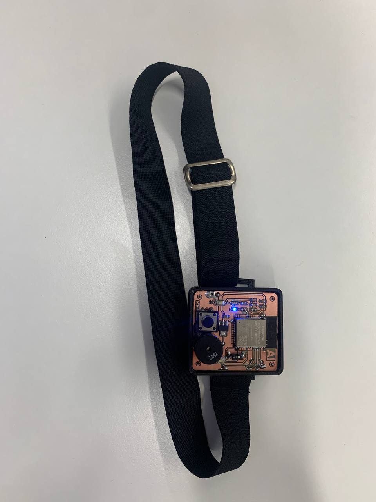
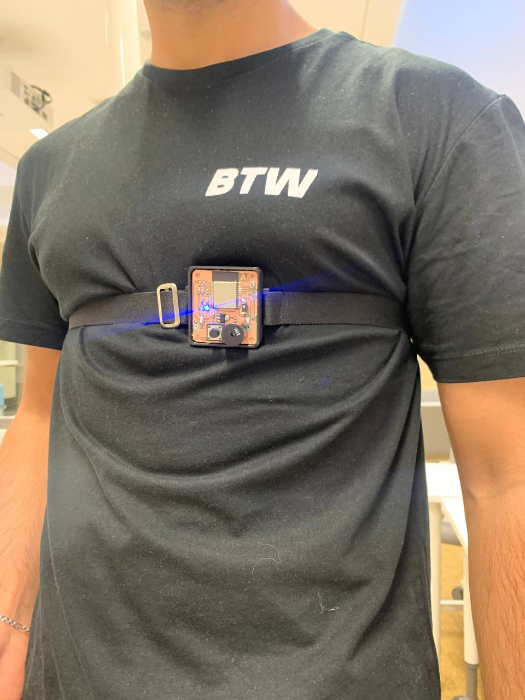

# Fall detection and BCG system (DSD project)

**This project is part of Aalto University's DSD project course (completed in spring 2022).*

### Directory structure:
- __*reports*__: includes device photos and assignment report (documentation)
- __*schema*__: includes Gerber files and implemetation information about PCB + components
- __*src*__: includes source code and user manual 

__* *More information about the results and summary can be found here [./reports/](./reports/)*__

 

## License
This work is licensed under a Creative Commons Attribution 4.0 International license. View the license at http://creativecommons.org/licenses/by/4.0/ or send a letter to Creative Commons, PO Box 1866, Mountain View, CA 94042, USA.