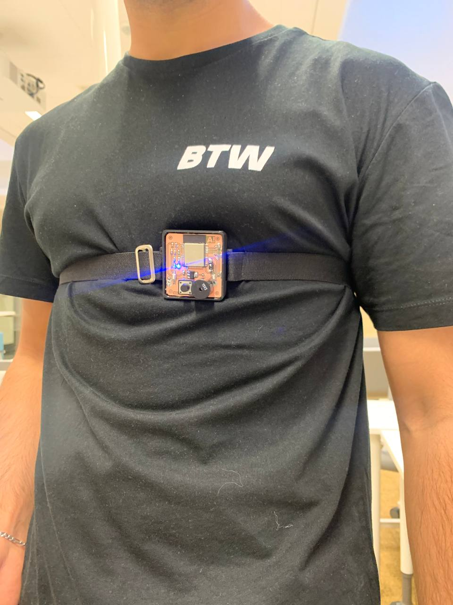

## 1. Introduction
Introduction Being aware and taking care of the health state is a popular phenomenon in modern society. A wide variety of different inventions related to human health have been created during the last decade. One such device is the DSD project system, which allows to take care of close people and get information about their health state. The main purpose of the device is to provide data about the health of the user. Nowadays, most old people might live alone, separately from their relatives. At this point, it may lead to the actual issue directly connected with their well-being. Sometimes, taking care of them or being aware of their health state can be problematic and can represent several inconveniences for their close people. 

One of such dangerous risks to the health of old people can be caused by falling. Falls result in various fractures around the hip and it is essential to get medical care as soon as possible for this as it can lead to massive internal bleeding. For the over-65-year-old population, falling can be a serious health risk. For instance, according to the Centers for Disease Control and Prevention, three million older people each year are treated in emergency rooms for fall-related injuries, and one in four older adults falls each year [1]. 

The first thing that comes to mind in order to manage this problem is providing human resources to the old person. However, it cannot be the actual solution for a large number of people in the elderly age category. The presented device takes into account all of such nuances and tries to satisfy them. Moreover, the high functionality of the product makes it unique and gives a possibility to use it for other categories of people which expands the target group. The device includes two main functions: a fall detection system and a BCG system. As was mentioned, due to this multi-functionality feature, the target audience can be variable. This is related to the fact that there is no strict rule that implies the device is only for people over 65. Therefore, people who have the desire to take care of their health are also able to use it, regardless of age category. Especially, the group of the population who suffer from heart disease tend to purchase this device in order to collect the data about ballistocardiography, which can be very essential for medical purposes. 

## 2. Fall detection system
### 2.1 Background
The mental health and well-being of people need to maintain autonomy and private time. This is also the motivation behind distance care scenarios for elderly people. Elderly patients are allowed to continue to live on their own, while possible accidents or critical situations are monitored by sensors installed in the environment or worn by the subject, which may comprise specific body-internal conditions, such as strokes, heart issues, or diabetes-related complications, as well as body-external events, such as falls. Indeed, among elderly people living on their own, falling, for instance, as a result of tripping, loss of balance, slipping or loss of consciousness, is a major health risk that can lead to severe injury. One-third of people above 65 years tend to fall, which might result in severe injuries [2]. In particular, it has been suggested that the event of a fall may be fatal for half of the elderly people who are unable to get up for an hour or more even without direct injuries [3]. In this context, fall detection systems that alert caregivers or other persons of trust provide the necessary protection in case of accidents or critical situations. An extensive amount of recent work has been conducted on fall detection systems based on a range of different approaches (wearable, environmental, etc.). Environmental technologies include computer vision, passive infrared sensors, and wireless technologies. Among these, computer vision-based approaches have proven to be highly accurate, however, they suffer in occlusion cases [4] and their perceived privacy intrusion may prevent an installation in private domains [5]. Other environmental sensing approaches comprise microphones, pressure, or vibration sensors, however, they are prone to error since other sources of pressure or sound may cause false alarms [6]. Recently, especially detection through RF-based approaches, such as radar, or channel state information (CSI, e.g. wireless sensor networks, WiFi) has become popular. CSI-based approaches are based on the time domain, or time-frequency domain, similar to radar-based fall detection. High recognition accuracies of 78% [7], 81% [8] and 93% [9] have been demonstrated in the literature. Among wearable technologies, a range of fall sensors has been proposed such as ECG, accelerometers, RFID, gyroscopes, pressure sensors and smartphones. While wearing sensors can be very effective, in particular in outdoor environments, it may not always be complied with by older people. In particular, for body-worn solutions, no protection is provided during periods in which the person decides to not wear the system, such as, for instance, during the night or in a (slippery) bathroom while having a shower. Among those elderly people who live on their own, about half of the falls occur outside their premises [9], which suggests the need for a reliable wearable fall detection scheme, which covers not only their own home but also arbitrary other environments. For a comprehensive survey on fall detection systems using various technologies, we refer to [11,12,13].

### 2.2 Operation of the device
The main purpose of the device as it was mentioned above is a give the signal to the responsible person when the user needs some help. The gadget is able to determine when the fall occurred. It considers several cases with executing different triggers, which make calculations to compare values of a sensor with various thresholds to determine the acceleration and changes in angle. In the case a fall is detected, the device waits for 10 seconds to cancel the signal sending, and at this moment the red LED with a buzzer will turn on. This step was implemented by taking into account that the user can activate the signal accidentally by hitting or dropping the device down. Cancelling the signal happens by double-pressing the Push Button located in the centre of the front side of the device. Finally, the signal will be cancelled by the user and the red LED with the buzzer will turn off. 

Otherwise, if the button is not pressed, a special signal generated by the buzzer will play louder and after a couple of seconds, the system sends a message “Fall detected” to the responsible person, who takes care of the user via Telegram. Meanwhile, the signal does not stop playing until the moment the button is pressed manually by the user or anyone else. This idea is implemented as a notification to others that the user needs urgent help. Ideally, the person who hears the sound of the device should be aware that the user has health issues and that some first aid is needed. 

The device system is directly connected to the Telegram application. A special TelegramBot was created, identified by a token, and assigned to the device in purpose that the person, who takes care can get updated about the state of the user. In other words, it operates as a bridge between the user and the responsible person. In addition, it can send notifications to several people at the same time. In other words, several family members can note the health of the user. 

The most important aspect that should be mentioned is the Internet connection. The device should always be connected to the internet to send the signal by Telegram. Internet credentials (e.g., name of API and password) can be filled into a special Wi-Fi Local Network window (automatically opened when the device is turned on) by the user or responsible person. This process will not represent any challenges, since no need for specific knowledge in programming (this will be described and explained properly in the next sections). Furthermore, everything related to working with the device is clearly explained step by step in the manual for the user section. 

The main components of the system are ESP-32, MPU-9250, a buzzer, a board for charging, an accumulator, and a push-button. ESP operates in the role of the “brain” in the system. It reads all values obtained by the accelerometer and makes essential calculations. Also, the fall detection part of the device uses an accelerometer MPU-9250, which contains an accelerometer and gyroscope that provides an opportunity to measure the acceleration and angle change of the device. The roles of the buzzer and button are simple and are briefly explained above. 

The system uses the I2C protocol. A serial asymmetric bus is used in electrical devices to communicate between integrated circuits. Low-speed peripheral components are connected to CPUs and microcontrollers through two bidirectional communication lines (SDA and SCL) (for example, on motherboards, embedded systems, and mobile phones) [14].

## 3. BCG system
### 3.1 Background
Nowadays, many methods to get cardio signals are known and commonly used in order to take necessary data related to human heart rate. The most popular among them are Electrocardiogram (ECG or EKG) and Ballistocardiogram (BCG). As previously mentioned, this device includes the function of BCG, which allows analyzing the heart state of a human. Since the device is specially designed for elderly people, controlling and tracking their heart rate is an essential factor in case of taking care them. Dozens of diseases directly related to heart diseases are widespread among the elderly people age of 65 and older compared to the younger age categories. Accident heart attacks or strokes can have hazardous consequences such as being disabled, lowering the quality of life or can lead to much worse scenarios [15]. 

The method was created and developed by American scientist Dr. Isaac Starr. Ballistocardiography is a method for studying the contractility of the heart muscles, recording mechanical displacements of the human body and identifying their consequences when blood is ejected from the heart into the aorta, pulmonary artery and blood flow through the vascular bed. It can be explained by the acceleration of blood which happens when a human is in a state of relaxation or contraction [16]. These cases occur with an apparatus (ballistocardiograph) in the form of a curve - a ballistocardiogram, which decreases with heart disease. The method gives a general idea of the state of the cardiovascular system, especially the contractility of the heart, and the elasticity of the main vessels. Generally, BCG measures the heart’s and blood’s mass during the movement like in the cardiac cycle and at the circulation moment. It leads to the theory that Ballistocardiography is able to provide the complete picture of the human circulation system [17]. 

### 3.2 Operation of the device
The main aspect that should be taken into account is that the user should be in a position of rest to start working with the device. This allows the system to operate properly and capture more accurate values of heart rate. The functioning of the device is quite simple. Basically a sensor detects and measures changes in the heartbeat. For example, in the beginning, when the function of the BCG is activated, the device starts data acquiring based on heartbeats. Finally, obtained data is processed and used for the calculation of beats per minute (BPM), which provides information on heart rate. Moreover, it should be mentioned that the data collection and measuring process includes filtration to make the obtained data more accurate by removing excess noise. 

For the filtration of data, the simple Kalman filter was applied. Before choosing the Kalman filter, several filters were observed, such as wavelet and bandpass filter. However, in our case, when there is a minimum number of sensors to obtain BCG data, the Kalman filter could provide more accurate data compared to other filters. The reason for utilization was the efficiency of the algorithm. The filter estimates unknown variables by making inaccurate measurements [18]. It is also known as a prediction algorithm. Generally, the parameters of the Kalman filter are provided by Gaussian probability density functions [19]. The author notes that the filter contains two phases, such as prediction and measurement update. 

The device is a combination of two systems as described earlier: Fall detection and BCG. In order to activate the BCG, the user should press the button three times after taking a rest position. After that, the device sends a special message about the BCG activation to the Telegram. At that time the system starts operating by measuring BCG, which leads to the determination of the heart rate. The device takes approximately 2.5 sec for one measurement that should include 2 heartbeats. This is an average number of heartbeats that should be observed from a normal person who was in a position of distress without any moves since by doing the activities the heartbeat becomes more frequent. This is occurred by comparing peaks of signals at that period and measuring the time between these peaks. The peaks denote information about the heartbeats of the user. In this way, the device completes 10 measurements in total and takes an average value of BPM. Finally, this provides data on the heart rate of the user. 

Subsequently, the BCG measurements take approximately 30 sec: 25 sec for 10 measurements, a couple of seconds for stabilization, and some time for filtration. As a result, all necessary data is sent to the necessary people (e.g., relatives of the user or doctors) via the Telegram app. In the Telegram application, if the heart rate of the user is normal, the device will send a message that everything is ok and no need to worry. However, if the heart rate is higher or lower than normal, the device will prompt the user to repeat the test after taking a rest position (the user may have performed some physical activity immediately before the test) or go to a doctor for professional advice.

%20and%20with%20in%20(red)%20filtiring%20(err_m07_q0001).png)
Figure A. This is a representation of the Kalman filter filtration result. Here, the blue signal is obtained data from the accelerometer and red is the same signal after the Kalman filtration. 

## 4. Implementation 
__* *More information about the device implementation (electronic circuit, PCB, gerber and components) can be found here [../schema/](../schema/)*__

## 5. The local network
__* *More information about the device source code can be found here [../src/](../src/)*__

## 6. Manual for the user
__* *More information about the user manual can be found here [../src/](../src/)*__

## 7. Results and Summary
During the soldering process, various problems have been faced, as mentioned in the previous sections. Mostly, they were related to the electronics parts. As was mentioned, because of problems with the details (they were out of stock), most components were replaced by alternative ones, which represented technical issues. For instance, the necessary model of ESP32 WROOM was unavailable for order, and finally, the alternative version was unable to operate in the current system. Despite this fact, fortunately, every problem was solved. As a result, the final device was fully created, designed and ready for use. The device is very comfortable for the body of the user and portable because of its small size. The size parameters of the device are 55 cm х 60 cm х 15 cm, which means that the device does not take up much space when the user wears it, Moreover, it operates properly because testing results demonstrated that the functioning of the final device is on a good level. The final product is illustrated in Figure 1 and 2.

 

*Figure 1. "The final device".*

At the last stage, a special strap was attached to the device so that it could be worn. This means that the device is wearable, allowing it to be kept on the user's body at all times, as shown in Figures 3 and 4. This device is truly considered to be a very essential gadget for many people in taking care of close people and making the world a better place to live in. 

 

*Figure 3. “Final look of the device”* & 
*Figure 4. “The device on the body”.* 

## 8. Future improvements 
- Adding a pulse meter to make the data of BCG more accurate. In that case, many external factors, such as breathing, which directly affect the accuracy of the results, will be excluded. It can be explained by the phenomenon that it would be possible to correct the BCG data with pulse meter data. 
- To create a more efficient algorithm and increase the number of sensors. This is related to the fact that more sensors will provide more qualitative data. 
- Creating own website for the device instead of using Telegram is one of the recommended ways to improve. This will provide a more user-friendly environment for the users and allow them to use the system comfortably.
- Adding a GPS to the device, which will show the current location of the user. This item makes it possible to track the user in case of need for assistance and hence, increases the level of care for the user from relatives or other close people. 

## References
1. Centers for Disease Control and Prevention. (2020, December 16). Keep on your feetpreventing older Adult Falls.
2. B. Erol, M. G. Amin, B. Boashash, F. Ahmad, and Y. D. Zhang. Wideband radar based 
fall motion detection for a generic elderly. In 2016 50th Asilomar Conference on Signals, 
Systems and Computers, pp 1768--1772, 2016.
3. Moeness G Amin, Yimin D Zhang, Fauzia Ahmad, and KC Dominic Ho. Radar signal 
processing for elderly fall detection: The future for in-home monitoring. IEEE Signal 
Processing Magazine, 33(2):71--80, 2016.
4. Ossi Kaltiokallio, Maurizio Bocca, and Neal Patwari. Enhancing the accuracy of radio 
tomographic imaging using channel diversity. In Mobile Adhoc and Sensor Systems 
(MASS), 2012 IEEE 9th International Conference on, pages 254--262. IEEE, 2012.
5. Leila Takayama, Caroline Pantofaru, David Robson, Bianca Soto, and Michael Barry. 
Making technology homey: finding sources of satisfaction and meaning in home 
automation. In Proc. of the 2012 ACM Conf. on Ubiquitous Computing, pages 511--520. 
ACM, 2012.
6. H. Wang, D. Zhang, Y. Wang, J. Ma, Y. Wang, and S. Li. RT-Fall: A Real-Time and 
Contactless Fall Detection System with Commodity WiFi Devices. IEEE Transactions on 
Mobile Computing, 16(2):511--526, 2017.
7. Wei Wang, Alex X. Liu, Muhammad Shahzad, Kang Ling, and Sanglu Lu. 
Understanding and Modeling of WiFi Signal Based Human Activity Recognition. In 
Proc. of the 21st Annual Int. Conf. on Mobile Computing and Networking, MobiCom‘15.
8. H. Wang, D. Zhang, Y. Wang, J. Ma, Y. Wang, and S. Li. RT-Fall: A Real-Time and 
Contactless Fall Detection System with Commodity WiFi Devices. IEEE Transactions on 
Mobile Computing, 16(2):511--526, 2017.
9. Palipana, S., Rojas, D., Agrawal, P., & Pesch, D. (2018). FallDeFi: Ubiquitous fall 
detection using commodity Wi-Fi devices. Proceedings of the ACM on Interactive, 
Mobile, Wearable and Ubiquitous Technologies, 1(4), 1-25.
10. L Day. Falls in Older People: Risk Factors and Strategies for Prevention. Injury 
Prevention, 9(1):93--94, 2003.
11. Muhammad Mubashir et al. A survey on fall detection: Principles and approaches. 
Neurocomputing, 100:144--152, 2013. 
12. Raul Igual et al. Challenges, issues and trends in fall detection systems. Biomedical 
engineering online, 12(1):66, 2013. 
13. Natthapon Pannurat et al. Automatic fall monitoring: a review. Sensors, 14(7):12900--
12936, 2014.
14. I2C. (n.d.). Retrieved April 21, 2022, from https://learn.sparkfun.com/tutorials/i2c/all.
15. U.S. Department of Health and Human Services. (n.d.). Heart health and aging. National 
Institute on Aging. Retrieved April 21, 2022, from https://www.nia.nih.gov/health/hearthealth-and-aging.
16. Giovangrandi, L., Inan, O. T., Wiard, R. M., Etemadi, M., & Kovacs, G. T. (2011). 
Ballistocardiography--a method worth revisiting. Annual International Conference of the 
IEEE Engineering in Medicine and Biology Society. Annual International 
Conference, 2011, 4279–4282. doi: 10.1109/IEMBS.2011.6091062.
17. Sadek, Ibrahim. (2018). Ballistocardiogram Signal Processing: A Literature Review.
19
18. A. Becker. (n.d.). Online kalman filter tutorial. Kalman Filter Tutorial. Retrieved April 
21, 2022, from https://www.kalmanfilter.net/default.aspx 
19. R. Faragher, "Understanding the Basis of the Kalman Filter Via a Simple and Intuitive 
Derivation [Lecture Notes]," in IEEE Signal Processing Magazine, vol. 29, no. 5, pp. 
128-132, Sept. 2012, doi: 10.1109/MSP.2012.2203621 

Moreover, most of the information on how to create a bot, how to connect Telegram with ESP32, 
and how to work with sensors for fall detection was taken from the next sources:

- Jaytee, Santos, S., Georges, Utne, S., Luiz, Santos, R., Bob, H, L., Eduardo, Luiz, Darby, 
G., B, F., Geoff, Müller, M., Fujita, R., Erni, Rpi, McAnderson, C., Gibbons, R., … 
Marcelo. (2020, September 2). Telegram: Esp32 motion detection with notifications. 
Random Nerd Tutorials. Retrieved April 21, 2022, from 
https://randomnerdtutorials.com/telegram-esp32-motion-detection-arduino/ 
- Parajuli, A. (2021, April 1). IOT based fall detection using NODEMCU and MPU6050 
sensor. The IOT Projects. Retrieved April 21, 2022, from https://theiotprojects.com/iotbased-fall-detection-using-nodemcu-and-mpu6050-sensor/ 
- Ludwig, S., Santos, S., Bruno, Brasil, R., Jakob, Santos, R., Reynolds, T., Gary, Law, S., 
ja49, Vabeek, Ramazan, Ramazan, Alejandro, Ian, Heideveld, E., Heideveld, B., Bert, 
Heideveld, B., … Jules. (2020, September 2). Telegram: Control esp32/ESP8266 outputs 
with Arduino IDE. Random Nerd Tutorials. Retrieved April 21, 2022, from 
https://randomnerdtutorials.com/telegram-control-esp32-esp8266-nodemcu-outputs