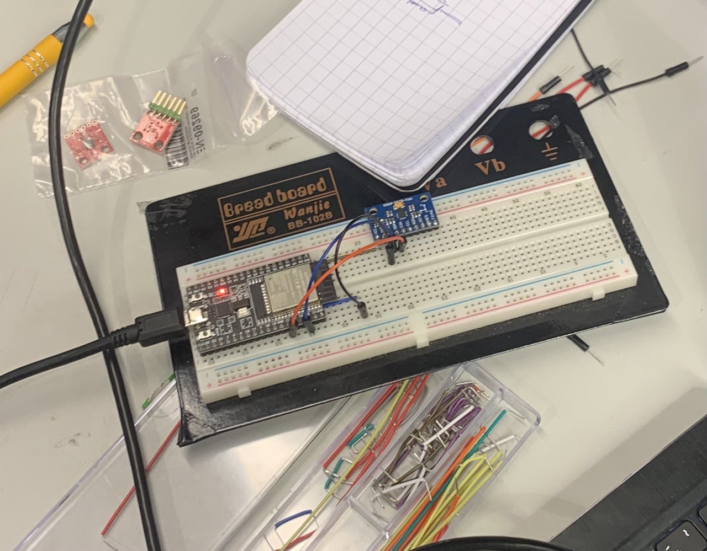
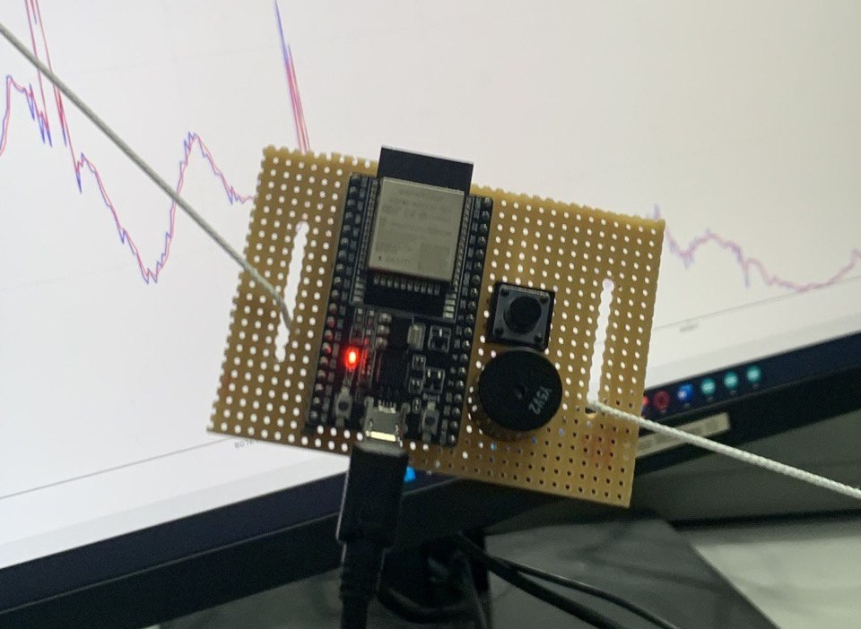
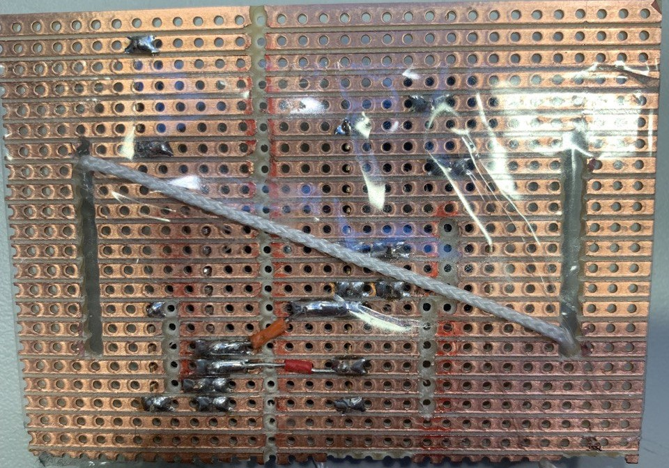
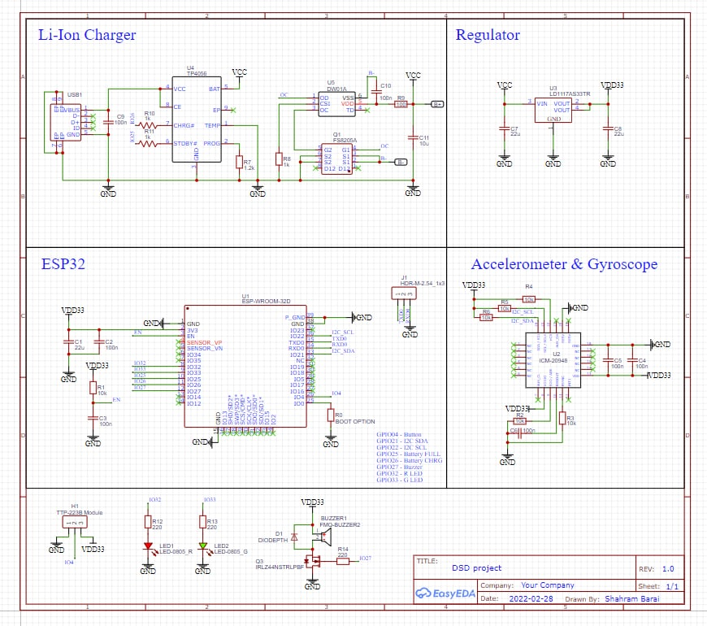
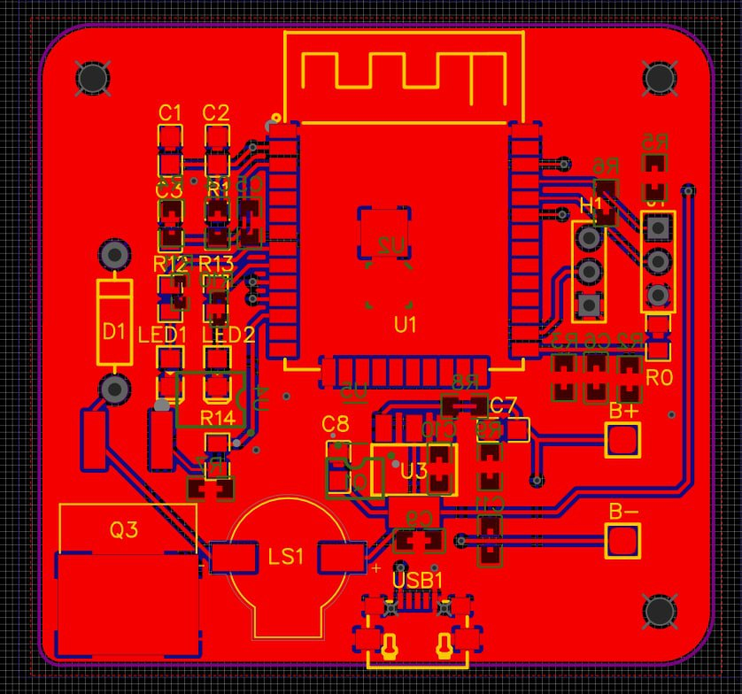
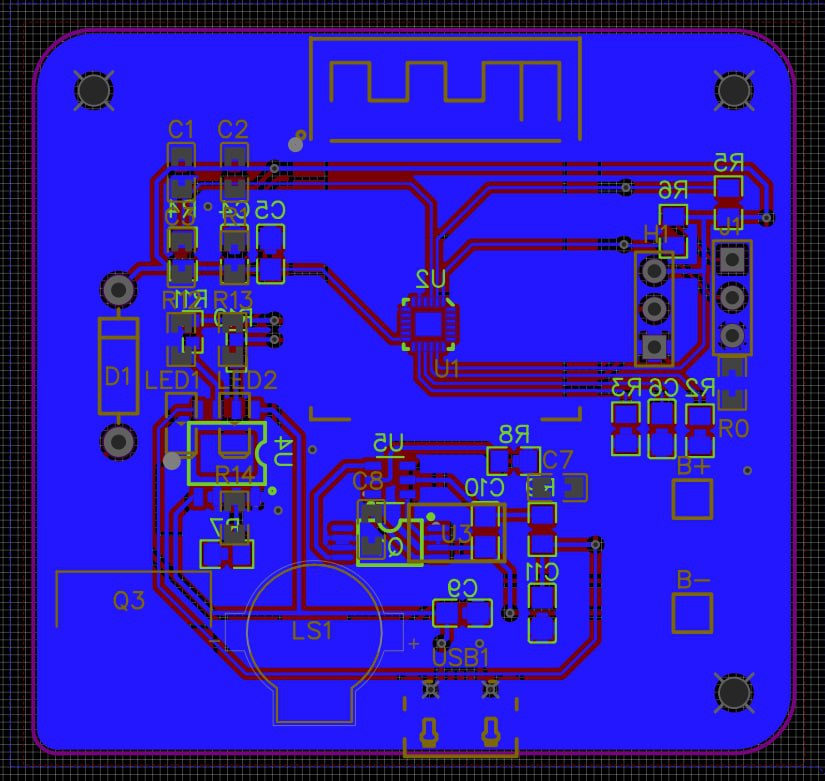
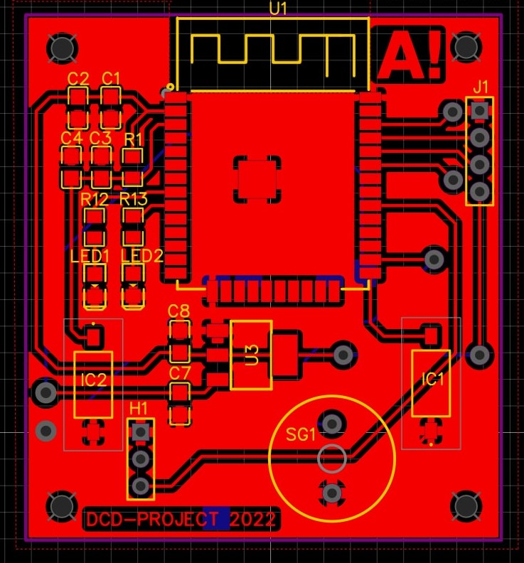
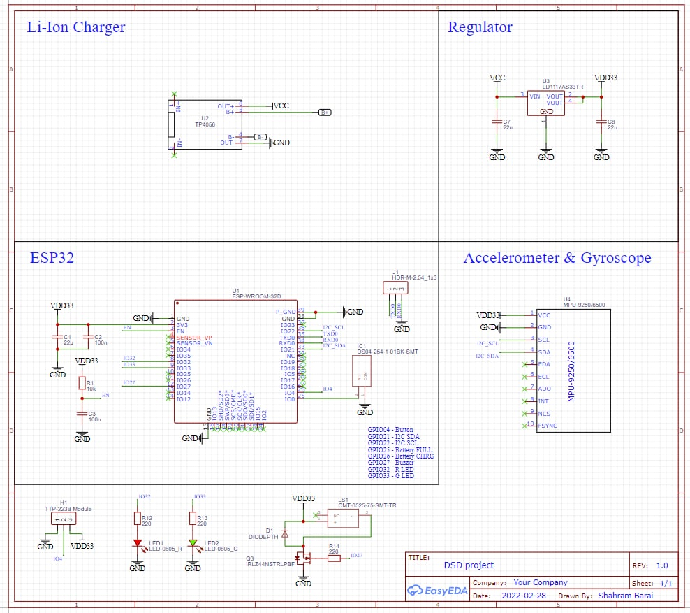
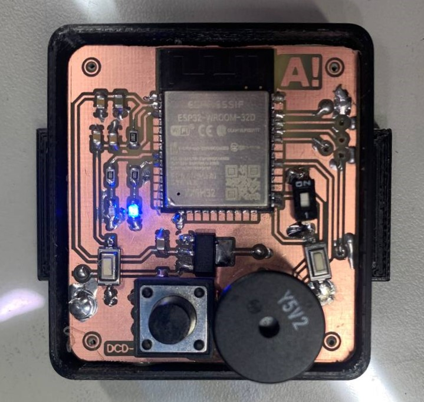

## Embedded Design Process

### Implementation

The implementation of the product started with the creation of a simple layout from ready modules. The process contained components such as ESP32, MPU-9250, a buzzer, and a button on a breadboard. It should be noted that at this stage layout was created and tested for the Fall detection system only. This was done to implement each part of the system separately without combining because it was decided that such a method allows it to work effectively and to find/improve a certain error quickly. The first layout can be seen in Figure 1.

*Fuqure 1. "The first layout"*

After testing and debugging all problems of the current system, the second stage of the implementation process was started. At that stage, the BCG system was implemented after quite much observation and research work. This is commonly related to the fact that the field of BCG was new and a bit difficult. Therefore, it required much effort to understand the point of the system. To achieve this goal, there were some discussions held with a professor and a doctoral student. Finally, everything was managed, including the code for the filtration process. It led to the creation of the second layout, which was more advanced compared to the previous model. The model consisted of modules essential for both systems (e.g., fall detection and BCG). Also, all of them were soldered on the stripboard, which provides an opportunity to test the device properly and makes it portable, as presented in Figure 2 and 3.

*Fuqure 2 and 3. “The second layout (front- and backside)”*

At this stage, some issues related to the operation of the system were faced, since combining two different systems represented different insignificant unforeseen errors. After that, it was decided to start the creation of our own board. It is assumed that creating own board will be more professional and more advanced. Therefore, for drawing the schematic of the board, the EasyEDA program was utilized. The schematic diagram of the system is illustrated in Figure 4.

*Figure 4. “The schematic diagram of own board”*

*Figure 5 and 6. “PCB of the board (front- and backside)”*

Once the schematics of the board were prepared, the actual board creation process began. Due to various factors including work equipment limitations and human error (our own mistakes), it took a considerable amount of time and effort. Additionally, multiple model versions were created before achieving the final result.

The board is designed for double-sided installation of components and is very accurate with tiny paths, connecting different details. Unfortunately, the sad thing was to know that this final board could not be used for the project. It was invalid because of the lack of the necessary components. It was discovered that most necessary components are out of stock for a long period. This difficult case represented a very huge challenge. Therefore, all alternative ways were considered and the project was adapted to current realities. Hence, another version of the final board schematic with the alternative components was created. Figures 7 and 8 demonstrate a new version of the final board schematic, which is only a one-sided board.

  

Figure 7. “PCB of the board”

*Figure 8. “The schematic diagram of the final board”*

Finally, this version was printed and used for the creation of the final board. Figure 9 presents the final version of the board, which is ready for soldering the components. As was mentioned, most of the components were not available for ordering. Subsequently, it was decided to use details, which are in the University lab as an alternative option. Nevertheless, the components in the lab were a bit different. Also, this case provided another problem related to the quantity: most of the components were single, which denoted that there is no chance of a mistake. In other words, everything should be completed ideally from the first try, which was a bit problematic for bachelor level students. 

  

Figure 9. “The final version of the board”

The case of the device was created by 3D printing. The front side of the case is open. This feature was implemented with the idea to make the board visible, which makes it more creative.

## Components of the device
Generally, the cost of the device is not expensive and affordable for everyone, who has a desire to purchase it. Table 1 shows the actual prices for each component that was ordered and the total price. It should be mentioned that in the components list, some details were ordered in several quantities. This was completed for safety purposes if some of them were out of use or broken during the implementation stage. This list is the initial one, which was created before the moment we knew that most of these components were unavailable. 

N.B., this list contains only the components, which were ordered (not all). Other suitable
components that were in the lab or at home were not ordered. The list with all components is 
presented below in Figure 10.

| Item | Part | Component | Qty | Cost/unit | Pricing (total) |
| ------ | ------ | ------ | ----- | --- | ----- |
|1| [Microcontroller](https://www.mouser.fi/ProductDetail/Espressif-Systems/ESP32-WROOM-32DM113DH3200PH3Q0?qs=W%2FMpXkg%252BdQ5YcAmhj3kVpA%3D%3D) | 356-ESP32WROOM-32D | 3 | 3,50 € | 10,50 € |
|2| Accelerometer & Gyroscope | 410-ICM-20948 | 2 | 12,68 € | 25,36 € |
|3| Low dropout linear regulator | 511-LD1117AS33 | 10 | 0,74 € | 7,40 € |
|4| Buzzer | SMD 490-CMT-0926-86SMTTR | 3 | 1,44 € | 4,32 € |
|5| Coin Cell Battery Holder | 712-BAT-HLD-006-SMT | 4 | 0,60 € | 2,38 € |
|6|	[SMD Switch](https://www.mouser.fi/ProductDetail/CUI-Devices/DS04-254-2-01BK-SMT?qs=wnTfsH77Xs7VDGZ8jaePmA%3D%3D)	| DS04-254-2-01BK-SMT | 5 | 0.62 € | 3.10 € |
| | | **Total** | | **19.58 €** | **53.06 €**|

*Table 1. Components list with prices*

*Figure 12. “Full components list”*

## License
This work is licensed under a Creative Commons Attribution 4.0 International license. View the license at http://creativecommons.org/licenses/by/4.0/ or send a letter to Creative Commons, PO Box 1866, Mountain View, CA 94042, USA.