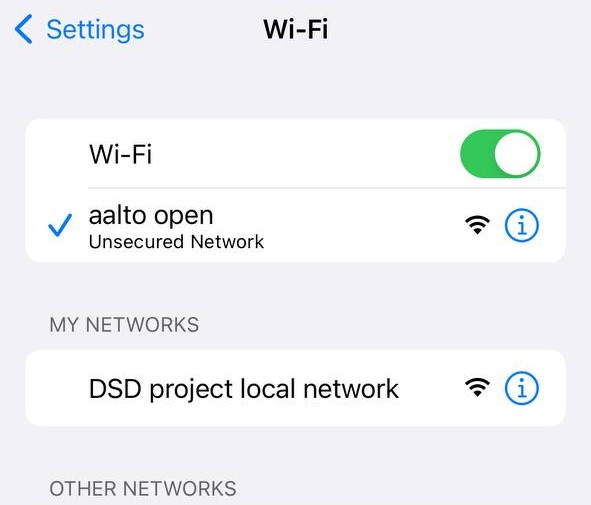
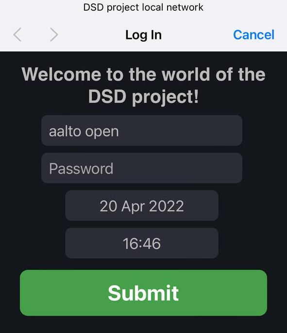

## The local network
From previous sections, it should be clear that the device operates with the Telegram app. This denotes that the device should be connected to the Internet in order to send data. For this purpose, the device always needs to be online, especially, in urgent cases. Therefore, the system always should know the SSID and password of the Wi-Fi. In order to connect the device to Telegram, the parameters of the Wi-Fi must be written in the code of the system. However, this method can be not convenient for the users since the Wi-Fi source can change every time and changing SSID and password directly from the code can represent some challenges. For instance, there can be some cases when the user does not have access to the computer. Finally, it was decided to create some “bridge” system, which allows connecting the device to the Internet and Telegram, accordingly. After some research, the most suitable decision on this issue was to create a local network. The local network means that when the device is turned on, the list of available Wi-Fi of the phone (with Telegram) will have a network named "DSD project local network", as shown in Figure 15. It was important to make the local network interface user-friendly and easy to understand for different categories of users. 

  

Figure 1. “Name of the local network”

After choosing and entering that local network, the window with fields for SSID and password will be opened (Presented in Figure 2). The user should fill in all required fields, depending on the SSID and Password. It should be mentioned that there can be some cases when Wi-Fi does not consist of a password. In such cases, the field password should be left empty, as shown in Figure 16. Finally, submitting this page leads to the saving of all data to the memory of the microcontroller, which means that the device automatically connects to the Internet. When the device is connected to the Internet, Telegram will send a message about activating the device.

  

Figure 2. “Local network interface”

## Manual for the user
Working with the device does not represent any kind of challenge because it is suitable for everyone and does not depend on the age category. Moreover, it does not require any specific knowledge in the sphere of technology. 
1. Creating a Telegram bot. The first thing that should be done is to create a special bot on Telegram. 
    - Start a new conversation with the BotFather.
    - Send/newbot to create a new Telegram bot.
    - Give a name and username to the bot.
    - Copy the Telegram bot token and paste it into the Telegram.h file (there is a special field for Telegram token).
    - After searching for “IDBot” and send “/getid” in the conversation with this bot.
    - It will provide UserID, which also needs to be pasted into the Telegram.h file. 
2. When the device is switched on, the list of available Wi-Fi on the phone will have a network named "DSD project local network", as described in detail in the “Local Network” section. 
3. The user should fill all fields when using the device for the first time (next time if nothing is changed, all info will be stored in the microcontroller memory). 
4. When everything is connected, the device will send the welcome message via Telegram, which means that you successfully started working with the system. 
5. When the device is turned on and detected fall, to cancel sending a signal to Telegram, the button should be pressed twice. 
6. In order to work with BCG data, the button should be pressed three times in a row when the user is in a rest position.

In addition, it is possible to make the device send messages to several users at the same time. For 
this purpose:
1. Create a new group chat on the Telegram.
2. Include all necessary people in this group chat
3. Include the bot that you have created and gave a name in the same group chat.
4. Include IDBot you used earlier in the same group chat.
5. Send /getgroupid in the group chat.
6. Your group ID will be replied ID, which should be used instead of UserID for the local 
network page.

## License
This work is licensed under a Creative Commons Attribution 4.0 International license. View the license at http://creativecommons.org/licenses/by/4.0/ or send a letter to Creative Commons, PO Box 1866, Mountain View, CA 94042, USA.